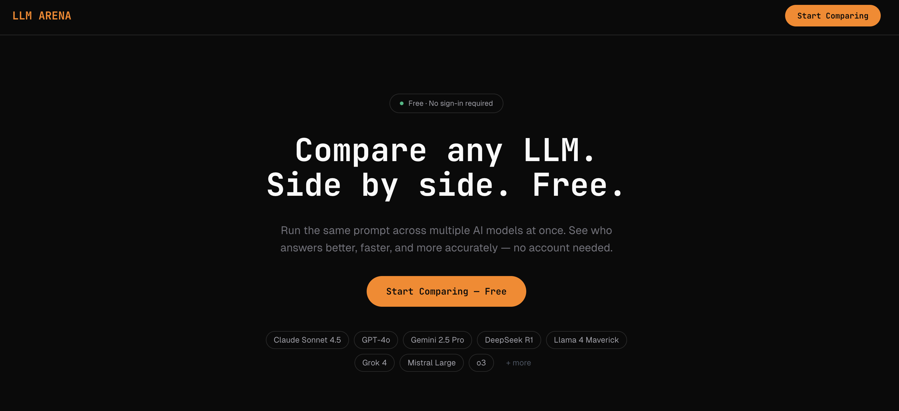
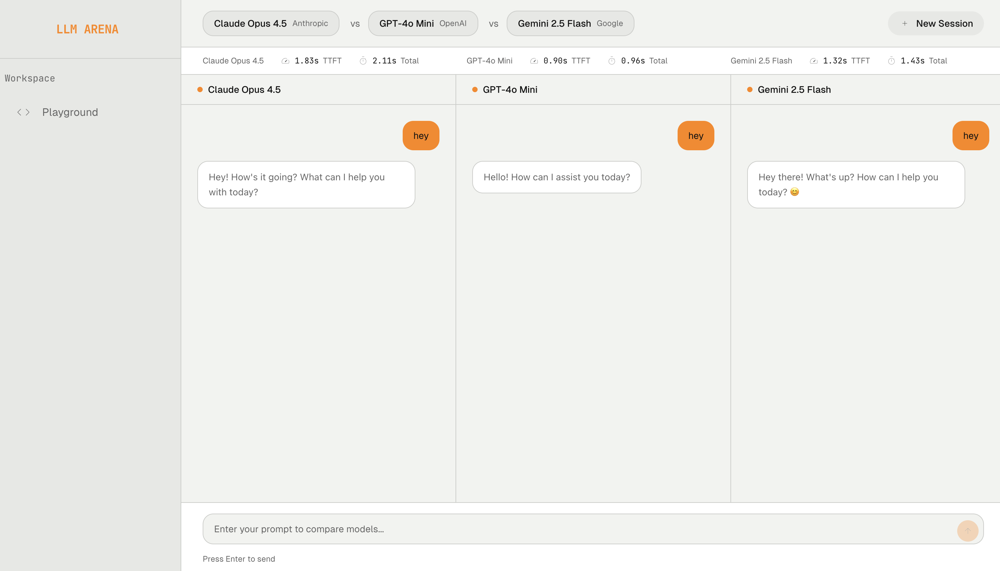

# llm arena

compare any llm. side by side. 




run the same prompt across multiple ai models at once and see who answers better, faster, and more accurately - no account needed.

---

## stack

- next.js 15 (app router)
- typescript
- tailwind css
- openrouter api

## setup

```bash
npm install
```

create `.env.local`:

```
OPENROUTER_API_KEY=your_key_here
```

get a key at [openrouter.ai](https://openrouter.ai)

```bash
npm run dev
```

## usage

1. pick up to 4 models
2. type a prompt
3. compare responses side by side
